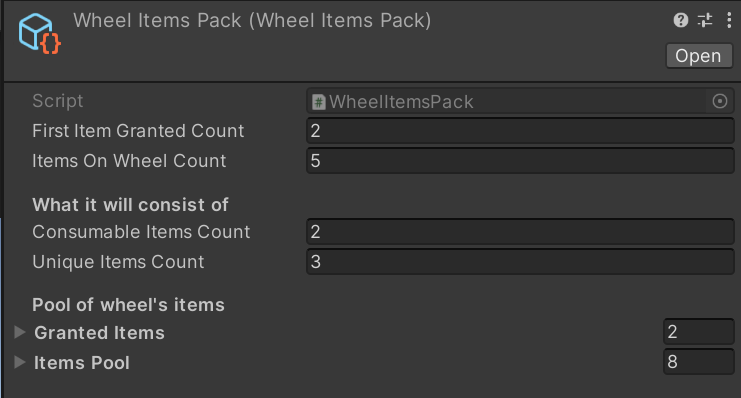
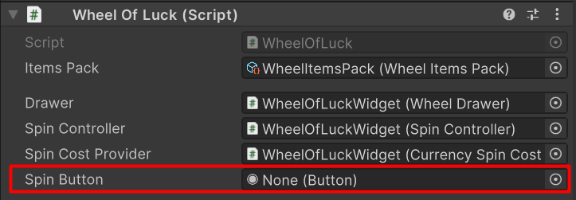
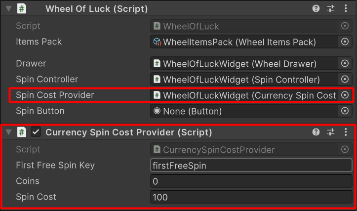
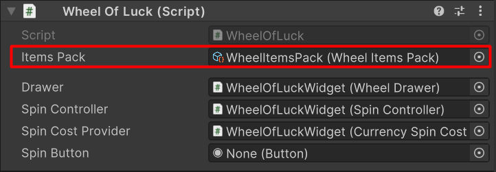

# Wheel Of Luck - Usage example
 
## Overview

The WheelOfLuck package provides a tools for creating and managing a "Wheel of Luck" feature, commonly used in games. This package includes interfaces, classes, and editors to facilitate the creation, customization, and management of wheel items, spin costs, and the view of the wheel.

## Package Features
- [X] Create your own types of wheel items
- [X] Implement your own way to collect items
- [X] Create your spin cost controller with your rules 

## How to use:
### 1. Add **DoTween** package: http://dotween.demigiant.com/download.php
### 2. Add **Text Mesh Pro** package from Unity Package Manager
### 3. Import WheelOfLuck package.
### 4. Create a Canvas and add WheelOfLuck prefab to it.
    Assets/PickerWheel/Prefabs/PickerWheel.prefab
### 5. Spin Cost Provider
#### You can use CurrencySpinCostProvider with it features or create your own cost provider
#### Example spin cost provider gives opportunity to get first spin for free 
```C#
public class CurrencySpinCostProvider : BaseSpinCostProvider
{
    [SerializeField] private string _firstFreeSpinKey = "firstFreeSpin"; 
    [SerializeField] private int _coins = 0;
    [SerializeField] private int _spinCost = 100;

    private bool _firstSpinFree;

    private void Awake()
    {
        if (PlayerPrefs.HasKey(_firstFreeSpinKey))
            _firstSpinFree = PlayerPrefs.GetInt(_firstFreeSpinKey) == 1;
        else
        {
            _firstSpinFree = true;
        }
    }

    private void Start()
    {
        UpdateAvailable();
    }

    // Required
    public override void OnSpinStart()
    {
        if (_firstSpinFree)
        {
            _firstSpinFree = false;
            PlayerPrefs.SetInt(_firstFreeSpinKey, 0);
        }
        else
        {
            _coins -= _spinCost;
        }
        
        UpdateAvailable();
    }
        
    // Required
    // Update property "Aveilable" and invoke event 
    protected override void UpdateAvailable()
    {
        if (_firstSpinFree)
        {
            Available = _firstSpinFree;
        }
        else
        {
            Available = _coins >= _spinCost;
        }
            
        OnSpinAvailableUpdated(Available);
    }

    private void OnValidate()
    {
        UpdateAvailable();
    }
```
### 6. Wheel items
### Same as with cost provider, you have two options implement your own or use already created items
### 6.1 Implementing new item type
```C#
// Required create asset menu
[CreateAssetMenu(order = 1, fileName = "CurrencyItem", menuName = "WheelOfLuck/Items/Currency")]
public class CurrencyWheelItem : WheelItem
{
    public override string Label => _amount.ToString();
    [SerializeField] private int _amount = 100;
    
    // Required
    public override void Collect()
    {
        // Custom currency save method
    }
}
```
### 6.2 Create assets of wheel item 
    1. Right Click on free space in Project window
    2. Go to WheelOfLuck
    3. Select ItemsPack

### 7. Create a WheelItemsPack asset
    1. Right Click on free space in Project window
    2. Go to WheelOfLuck -> Items
    3. Select on of wheel item types
    4. Configure items pack(add granted items, items pool, etc.)



### 8. Create Spin Button and reference it to WheelOfLuck component property

### 9. Add concrate Spin Cost Provider script to WheelOfLuck object and add refecrence to WheelOfLuck component


### 10. Reference Wheel Items Pack asset to WheelOfLuck component property


## Architecture
### Interfaces
- ICollectable
- IReadOnlyWheelItem
### Abstract Classes 
- BaseSpinCostProvider
- WheelItem : IReadOnlyWheelItem, ICollectable
### Models
- WheelItemsPack
### Controllers
- SpinController
### View
- WheelDrawer
### Editor
- WheelItemsPackEditor
### Main Class
- WheelOfLuck